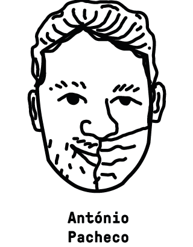
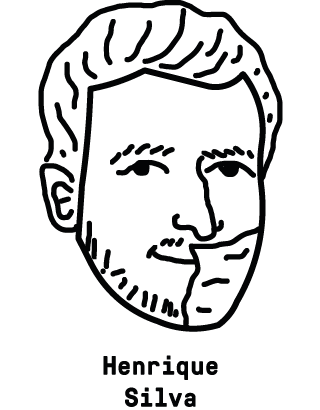
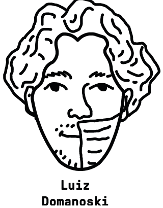
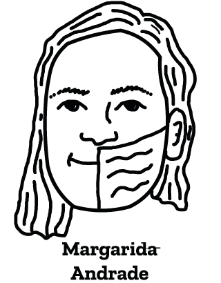

# Emergence Açores 2021 - Aguenta-te

Considerando que os movimentos de vertente são um risco quase permanente na Ilha de São Miguel e que esse evento tem a suscetibilidade potencializada com a desflorestação em encostas, buscou-se aqui apresentar, de forma lúdica, o papel da vegetação na mitigação destes riscos, e o modo pelo qual a associação de áreas florestadas com a agricultura pode contribuir para uma vivência sustentável e em harmonia com a natureza.

| [A Nossa Página](https://aguentate.pages.dev/) | [A Nossa Experiência](https://aguentate.pages.dev/aguentate/aguentate.html) |
| :--------------------------------------------: | :----------------------------------------------------------: |

## A Equipa

|  |  |  |  |  |
| ---- | ---- | ---- | ---- | ---- |
